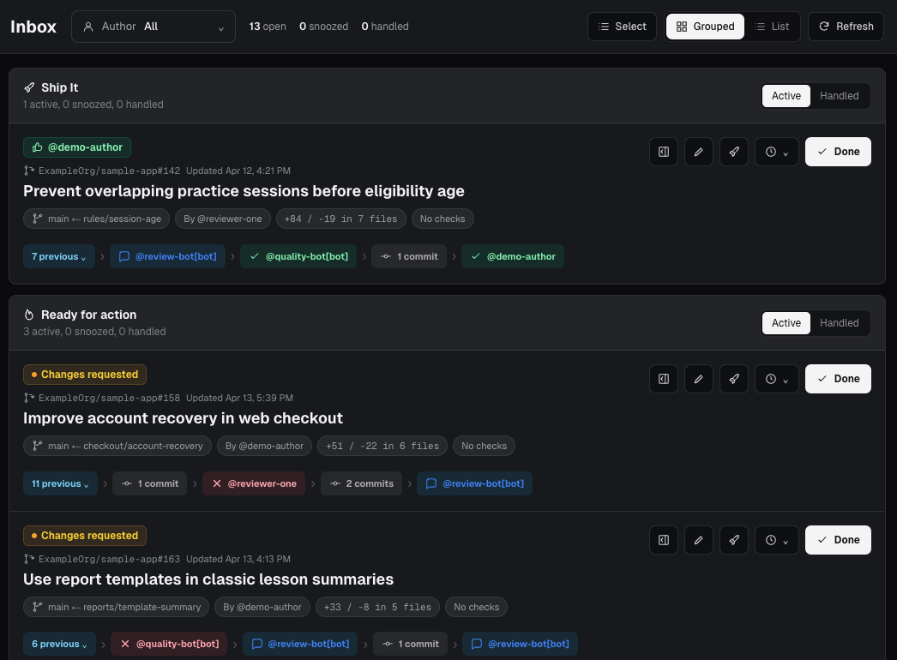

# MergeTray


MergeTray is a dashboard for your PRs. Know what needs your attention
quickly, across all your repositories, so you can deploy faster.

<br clear="left">



## Benefits

- Know which PRs need attention easily.
- Keep active, snoozed, and handled PRs separate.
- Filter PRs by repository, ownership, or author.
- See dependent PRs together in stacks.
- See branch, change, check, review, and activity details without opening each
  PR on GitHub.
- Compare GitHub's change totals with reviewable totals that omit configured
  file patterns.
- Add notes to PRs.
- Apply Ship It, snooze, and done actions to one or several PRs.
- See the latest 25 merged PRs and filter them by repository.
- Keep review data and personal workflow state on your machine.
- Receive GitHub updates every five minutes or through optional webhooks.
- Use system, light, or dark mode.
- Start and continue Codex tasks from PRs.

Ship It promotions, snoozes, notes, and handled status are local to MergeTray.
Normal inbox actions do not change the pull request on GitHub.

## Why not (some other tool)?

- GitHub Inbox - honestly, it's terrible
- Linear Inbox - it's generally good, but doesn't give me all the info I want up front
- Graphite - same, this is my favorite of the bunch, but I want more info at a glance

## Quick start

Prerequisites:

- Node.js 24.15 or newer (`.node-version` pins the tested version)
- pnpm 11
- [GitHub CLI](https://cli.github.com/)

```bash
git clone https://github.com/harvitronix/mergetray
cd mergetray
pnpm install
pnpm mergetray setup
pnpm mergetray start
```

Open [http://localhost:3002](http://localhost:3002) to use.

To use another port:

```bash
pnpm mergetray start --port 4000
```

To add or remove repositories non-interactively:

```bash
pnpm mergetray setup --add-repos owner/repo,another/repo
pnpm mergetray setup --remove-repos old-owner/old-repo
```

## CLI

```text
pnpm mergetray doctor
pnpm mergetray doctor --json
pnpm mergetray setup [--add-repos owner/repo,...] [--remove-repos owner/repo,...] [--webhooks|--no-webhooks] [--no-login]
pnpm mergetray start [--port 3002]
pnpm mergetray webhooks [--port 3002]
```

If webhook forwarding is already registered, MergeTray asks before replacing
it. Use `--take-over-webhooks` to confirm the replacement during unattended
startup. Declining leaves five-minute polling active.

## Security

MergeTray is a single-user local application. The
supported `pnpm mergetray start` command binds the web server to `127.0.0.1`,
and there is no MergeTray account, cloud database, or application-level
authentication. MergeTray does not implement its own telemetry; Next.js
telemetry follows your local Next.js preference. Do not expose the server to a
network or put it behind a public reverse proxy.

MergeTray makes outbound requests to GitHub and, when enabled, uses GitHub's
webhook forwarding service. Pull request metadata, cached GitHub responses,
inbox state, notes, settings, Codex task links, and managed worktree records are
stored in the local SQLite database. The database is not encrypted by
MergeTray; protect it with your operating system account permissions and disk
encryption.

MergeTray gets a token from the active `gh` session when making GitHub requests
but does not save that token in SQLite. GitHub CLI owns credential storage; run
`gh auth status` to inspect the active account and storage location.

MergeTray's normal polling only reads from GitHub. Optional webhook forwarding
installs the `cli/gh-webhook` GitHub CLI extension when needed and creates
repository or organization webhook configuration through GitHub's forwarding
service. All application data is stored locally in the SQLite database.

Configure diff file filters in Settings to exclude generated files, tests, or
other paths from reviewable additions, deletions, and file counts. MergeTray
keeps GitHub's original totals visible and calculates reviewable totals from
the stored per-file data when it loads the inbox.

## GitHub access and scopes

`pnpm mergetray setup` uses GitHub CLI's standard login, whose minimum OAuth
scopes are:

- `repo` to read pull requests and related metadata, including private
  repositories the account can access;
- `read:org` to read team membership used for review requests;
- `gist`, which GitHub CLI requires but MergeTray does not use.

Normal polling reads GitHub data and does not post reviews, comments, or change
pull requests. Optional organization-level webhook forwarding requests
`admin:org_hook`. If that scope is unavailable, setup falls back to forwarding
the selected repositories individually. MergeTray can only see repositories
available to the active GitHub token.

## Optional Codex integration

MergeTray can suggest and link local Codex tasks whose repository and branch
match a pull request. The integration is disabled by default. Enable it from
Settings after installing the [Codex CLI](https://learn.chatgpt.com/docs/codex/cli)
and signing in with `codex`.

When enabled, the `codex` binary must be available on your local
`PATH`. MergeTray uses the experimental
[Codex app-server](https://learn.chatgpt.com/docs/app-server) protocol to power
the embedded conversation and discover local active and archived tasks. Task
scans are loaded when the Codex section is opened and briefly cached.
Run `pnpm mergetray doctor` to check whether the CLI is available and whether
the integration is enabled.

The `/codex` page can start or resume a local Codex task, stream replies and
tool activity, surface approval requests, and show the current turn's diff.
Turns start in a read-only sandbox, with approval requests reviewed
automatically by Codex.
Configure a local checkout for each repository in Settings to start or recover
a task for one of its pull requests. A new PR task is created on the first
message in a detached worktree at the recorded head commit and linked back to
the PR. Recovery uses the same kind of worktree, forks the unavailable task,
and updates the PR link while retaining the original task. MergeTray stores
these worktrees beside its database and does not remove them automatically.
Settings lists every outstanding managed worktree and its safety state. Manual
cleanup is available only when the Codex task is inactive and Git reports a
clean, registered worktree. Cleanup archives the Codex task, removes and prunes
the worktree, and retains the cleanup timestamp in MergeTray's registry.

## Optional webhook refreshes

GitHub webhooks can trigger targeted pulls - disabled by default.
You can enable it through the interactive setup, or directly with:

```bash
pnpm mergetray setup --webhooks
```

## Data

The database and HTTP cache live in `.mergetray/`, which is ignored by Git. Set
`MERGETRAY_DATA_DIR` to use another directory:

```bash
MERGETRAY_DATA_DIR=/path/to/data pnpm mergetray setup
```

## Development

```bash
pnpm format:check
pnpm lint
pnpm typecheck
pnpm test
pnpm build
```

Run all checks with `pnpm check`.

## Roadmap/Future

- Linear integration
- Claude Code integration
- Remote database support to use across devices
- More direct control over PRs from within MergeTray, like enabling automerge (though we're currently intentionally read only)

## Contributing

Feel free to log an issue or open a PR.
